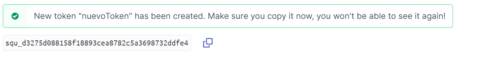
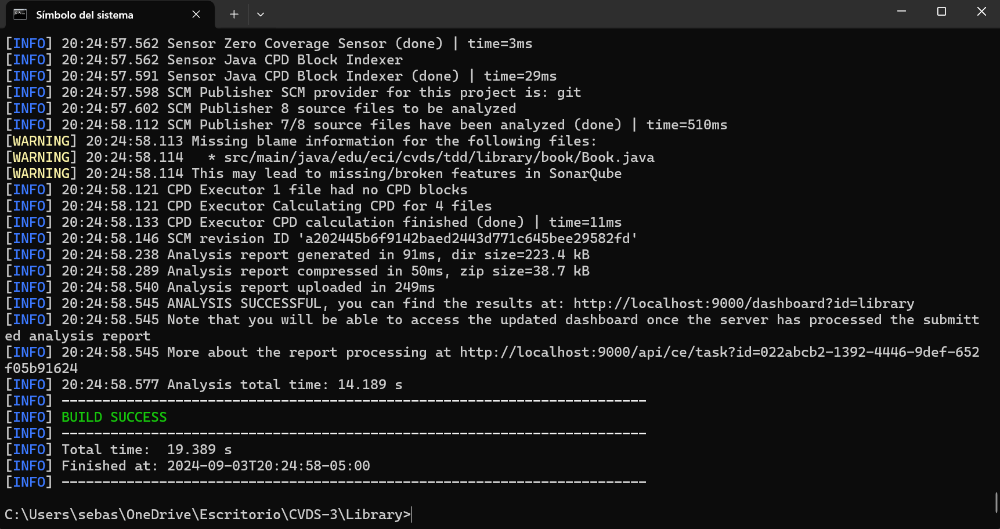
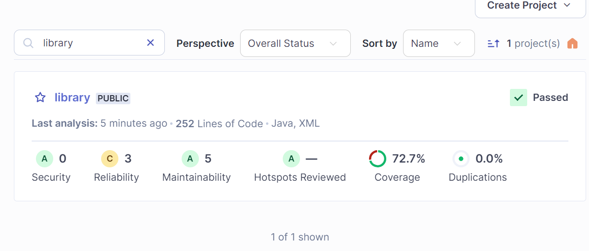

Aca se pueden ver los directorios ya creados.

Compilamos el proyecto y pasa correctamente

Instalamos sonarqube con el comando

Iniciamos el servicio de SonarQube

Validamos el funcionamiento

Ejecutamos el contenedor de docker para sonarqube

Iniciamos sesión en sonar, clave y contraseña admin

Generamos un token

Probamos el test de agregar un libro, pero al no haber un codigo implementado, falla

Después de agregar codigo, el test pasa correctamente

Parte de docker y sonarqube
Una vez iniciada la sesión como admin en localhost:9000, generamos el token

Después de poner el comando dado para probar que todo haya quedado bien en sonar, arroja lo siguiente

En localhost:9000, evidenciamos que funcionó el proyecto, solo nos falta una prueba para lograr la cobertura que se espera
