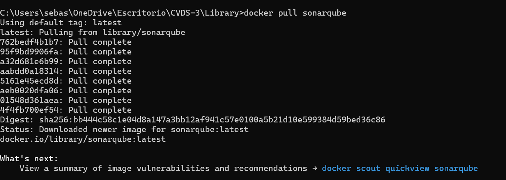
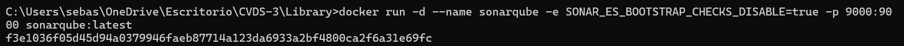
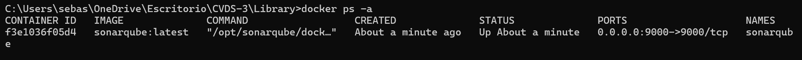
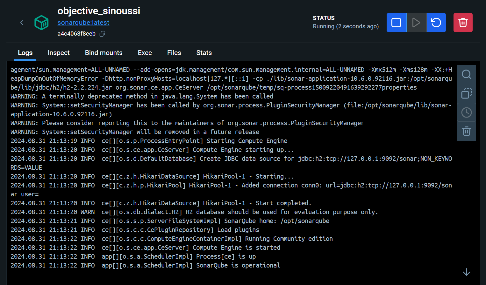
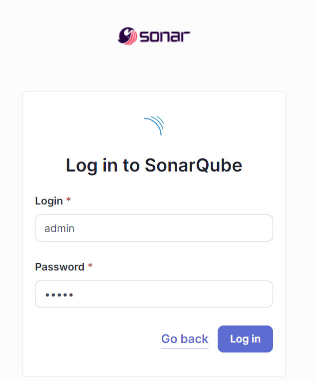
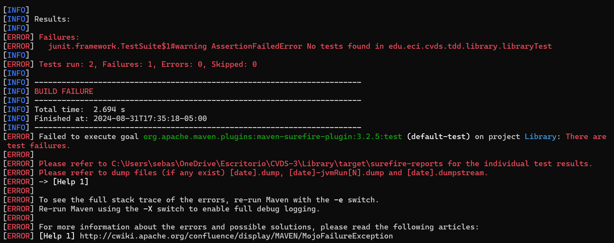
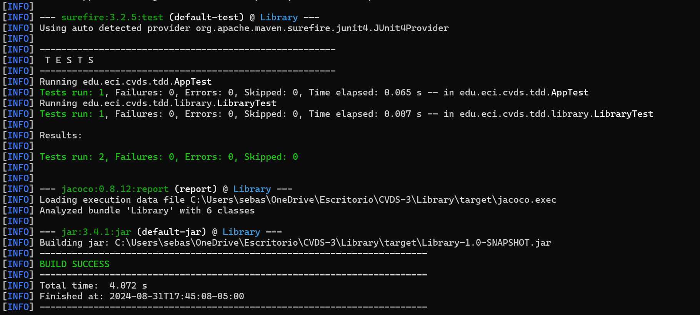

Aca se pueden ver los directorios ya creados.

Compilamos el proyecto y pasa correctamente

Instalamos sonarqube con el comando

Iniciamos el servicio de SonarQube

Validamos el funcionamiento

Ejecutamos el contenedor de docker para sonarqube

Iniciamos sesión en sonar, clave y contraseña admin

Generamos un token

Probamos el test de agregar un libro, pero al no haber un codigo implementado, falla

Después de agregar codigo, el test pasa correctamente

