Aca se pueden ver los directorios ya creados.
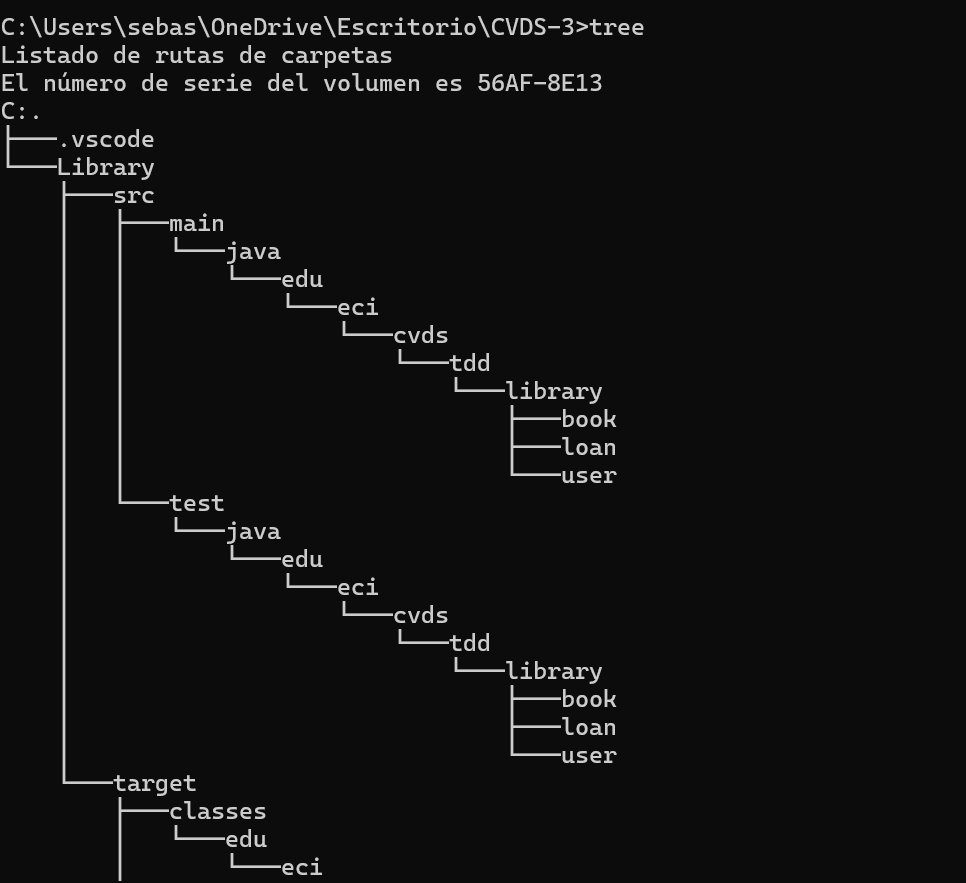

Compilamos el proyecto y pasa correctamente
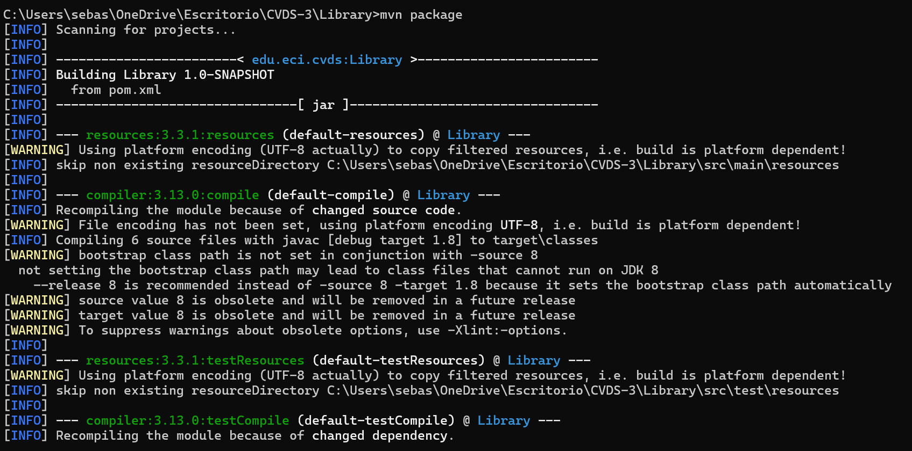

Instalamos sonarqube con el comando
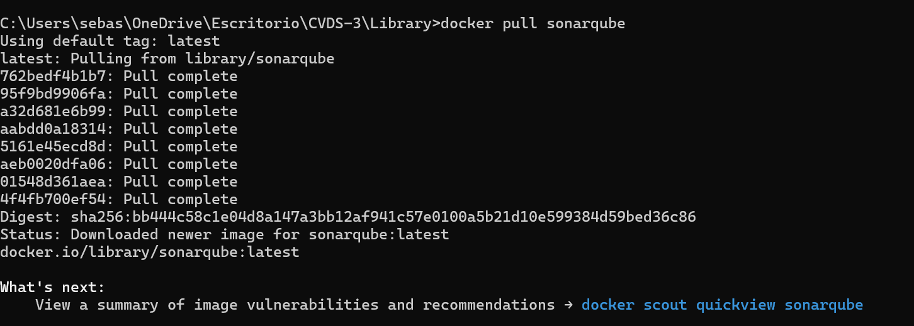

Iniciamos el servicio de SonarQube
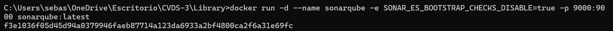

Validamos el funcionamiento
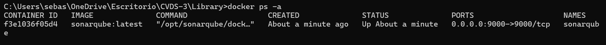

Ejecutamos el contenedor de docker para sonarqube
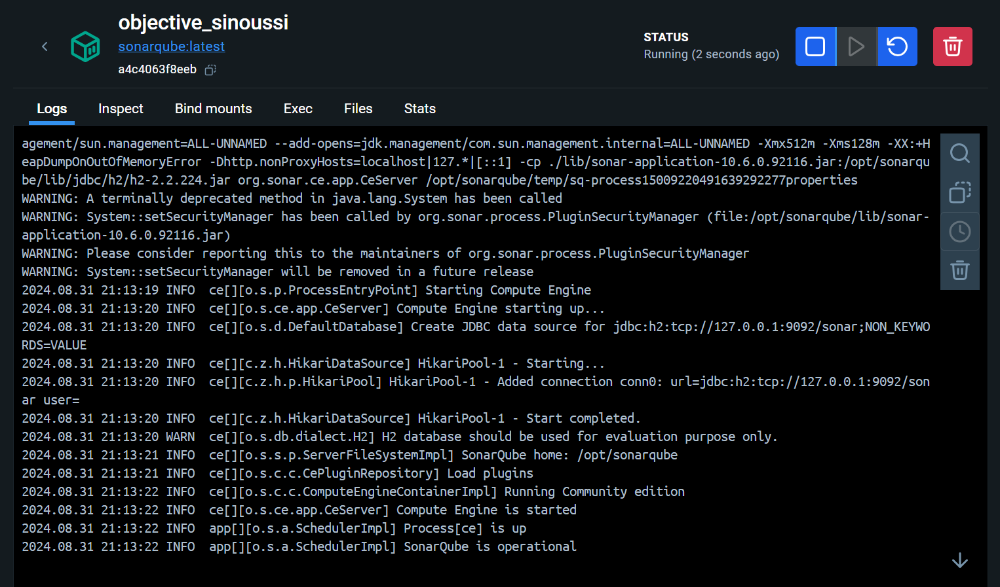

Iniciamos sesión en sonar, clave y contraseña admin
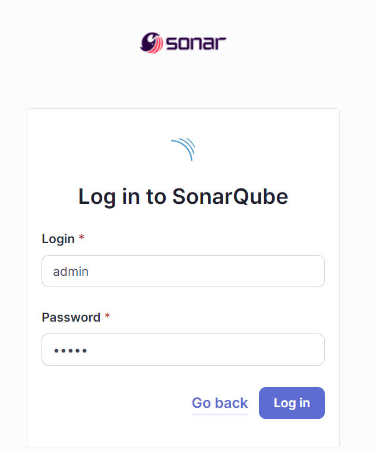

Generamos un token

Probamos el test de agregar un libro, pero al no haber un codigo implementado, falla
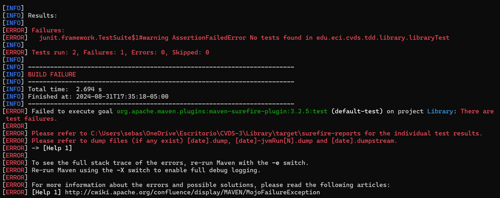

Después de agregar código, el test pasa correctamente
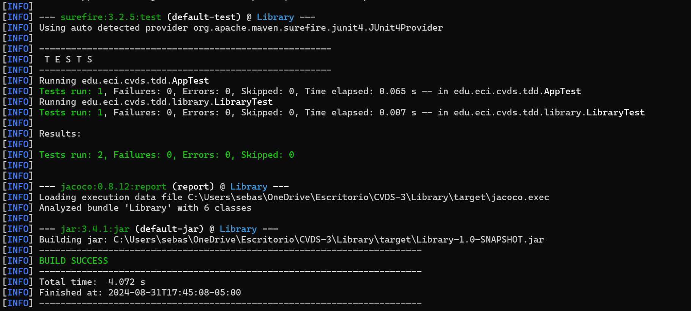

Parte de docker y sonarqube
Una vez iniciada la sesión como admin en localhost:9000, generamos el token
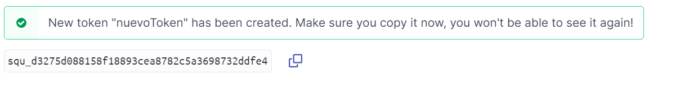

Después de poner el comando dado para probar que todo haya quedado bien en sonar, arroja lo siguiente
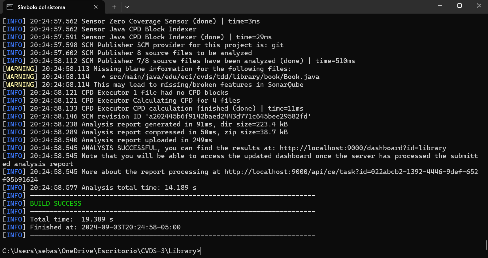

En localhost:9000, evidenciamos que funcionó el proyecto, solo nos falta una prueba para lograr la cobertura que se espera
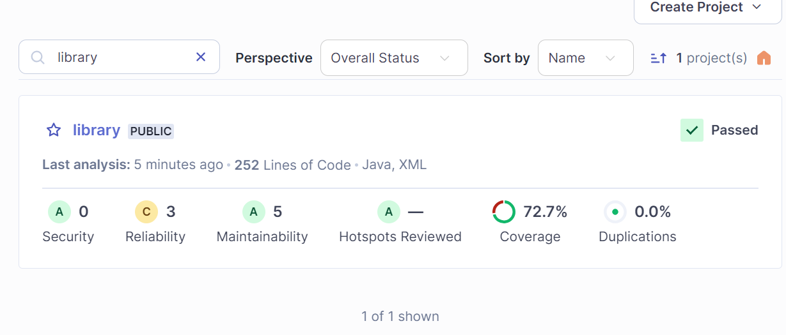

Parte final
Con el plugin de jacoco, vemos que quedó por encima del 85%, por lo tanto se puede pasar el proyecto en sonar
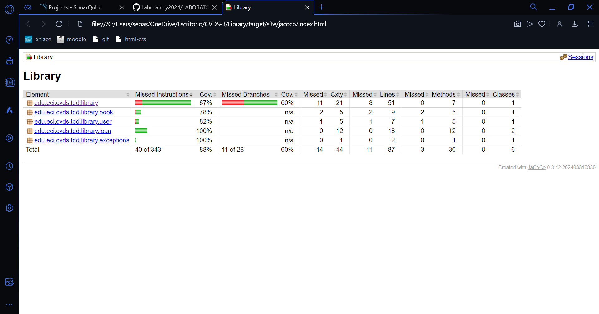

Aquí podemos ver que la cobertura está sobre el 80% en sonar
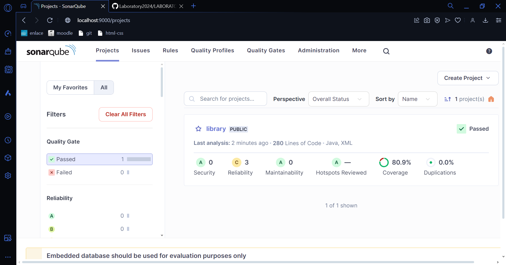

Los 7 test que fueron necesarios para que se alcanzara el porcentaje deseado pasan
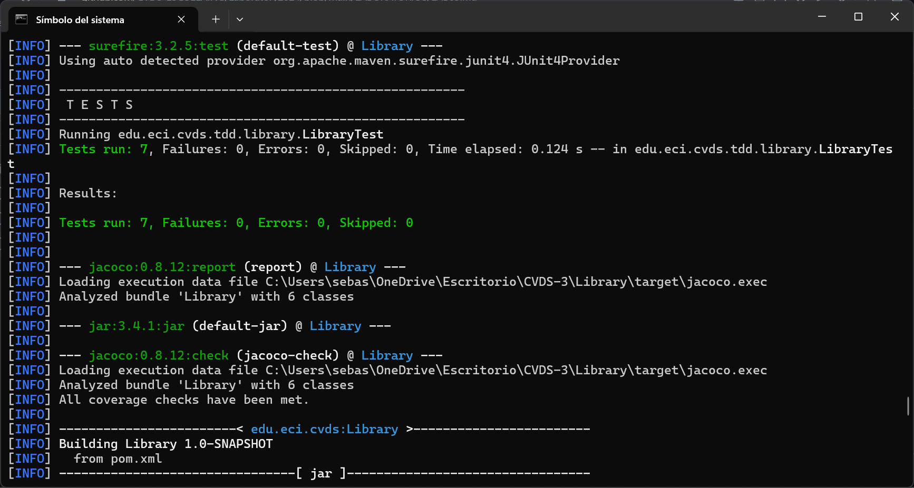

Compila la integración de sonar
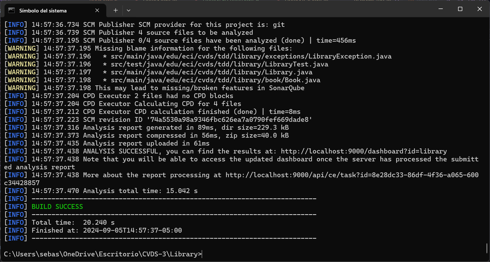
